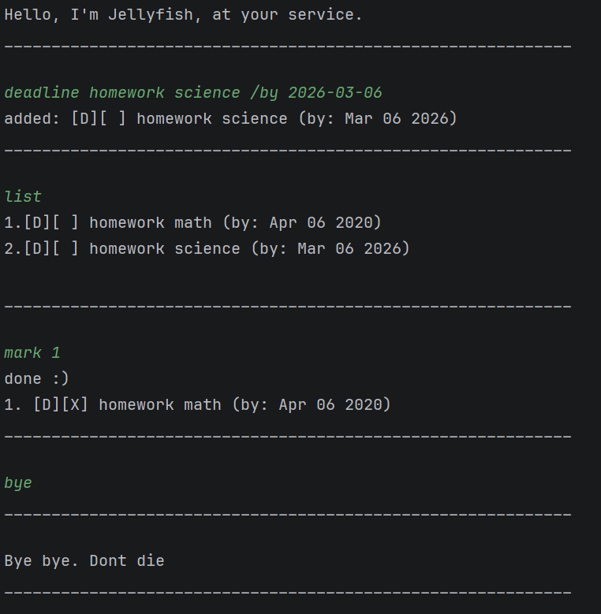

# JellyFish User Guide

// Update the title above to match the actual product name



Jellyfish is a task management chatbot that helps you track todos, deadlines, and events via a command-line interface. 
Tasks are saved automatically and restored every time you start the bot.

## Quick Start

1. Ensure you have **Java 17** installed on your computer.
2. Download the latest `jellyfish.jar`.
3. Copy the file to the folder you want to use as the home folder for Jellyfish.
4. Open a command terminal, `cd` into the folder, and run `java -jar jellyfish.jar`.
5. Type a command and press **Enter** to execute it.

### Adding a deadline : `deadline`

Adds a task with a deadline.

Format: `deadline DESCRIPTION /by DATE`

Examples:
```
deadline return book /by 2019-12-06
```
```
added: [D][ ] return book (by: Dec 06 2019)
____________________________________________________________
```
```
deadline submit report /by tonight
```
```
added: [D][ ] submit report (by: tonight)
____________________________________________________________
```


### Adding a todo : `todo`

Adds a task with no date attached.

Format: `todo DESCRIPTION`

Example:
```
todo read book
```
```
added: [T][ ] read book
____________________________________________________________
```


### Adding an event : `event`

Adds a task with a start and end date or time.

Format: `event DESCRIPTION /from START /to END`

Example:
```
event project meeting /from 2019-12-06 /to 2019-12-07
```
```
added: [E][ ] project meeting (from: Dec 06 2019 to: Dec 07 2019)
____________________________________________________________
```


### Listing all tasks : `list`

Shows all tasks currently in the list.

Format: `list`
```
1.[T][ ] read book
2.[D][ ] return book (by: Dec 06 2019)
3.[E][ ] project meeting (from: Dec 06 2019 to: Dec 07 2019)
____________________________________________________________
```


### Marking a task : `mark`

Marks the specified task as done.

Format: `mark INDEX`

- The index refers to the index number shown in the task list.
- The index must be a positive integer 1, 2, 3, ...

Example:
```
mark 1
```
```
done :)
1. [T][X] read book
____________________________________________________________
```


### Unmarking a task : `unmark`

Marks the specified task as not done.

Format: `unmark INDEX`

Example:
```
unmark 1
```
```
not done :(
1. [T][ ] read book
____________________________________________________________
```


### Deleting a task : `delete`

Deletes the specified task from the list.

Format: `delete INDEX`

- The index refers to the index number shown in the task list.
- The index must be a positive integer 1, 2, 3, ...

Example:
```
delete 2
```
```
deleted 2. [D][ ] return book (by: Dec 06 2019)
____________________________________________________________
```


### Finding tasks by keyword : `find`

Finds all tasks whose descriptions contain the given keyword.

Format: `find KEYWORD`

- The search is case-insensitive. e.g. `book` will match `Book`
- Only the task description is searched.
- Partial words will be matched. e.g. `boo` will match `book`

Example:
```
find book
```
```
Here are the matching tasks in your list:
 1.[T][ ] read book
 2.[D][ ] return book (by: Dec 06 2019)
____________________________________________________________
```


### Exiting the program : `bye`

Exits the program.

Format: `bye`


### Saving the data

Jellyfish data is saved to the hard disk automatically after any command that changes the data. 
There is no need to save manually.

### Editing the data file

Jellyfish data is saved as a text file at `[home folder]/data/jellyfish.txt`. 
Advanced users are welcome to update data directly by editing that file.

> **Caution:** If your changes to the data file make its format invalid, 
> Jellyfish may skip corrupted entries at the next run. 
> It is recommended to take a backup of the file before editing it.


## FAQ

**Q: How do I transfer my data to another computer?**

A: Install the app on the other computer and replace the empty `data/jellyfish.txt` it creates with the file from your previous Jellyfish home folder.


## Command Summary

| Action | Format, Examples |
|--------|-----------------|
| Add todo | `todo DESCRIPTION` e.g. `todo read book` |
| Add deadline | `deadline DESCRIPTION /by DATE` e.g. `deadline return book /by 2019-12-06` |
| Add event | `event DESCRIPTION /from START /to END` e.g. `event meeting /from 2019-12-06 /to 2019-12-07` |
| List | `list` |
| Mark done | `mark INDEX` e.g. `mark 1` |
| Mark not done | `unmark INDEX` e.g. `unmark 1` |
| Delete | `delete INDEX` e.g. `delete 3` |
| Find | `find KEYWORD` e.g. `find book` |
| Exit | `bye` |